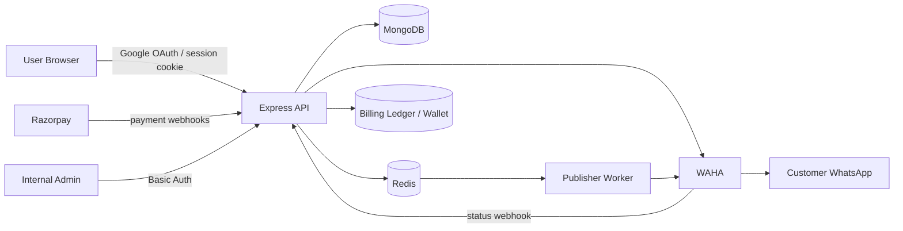
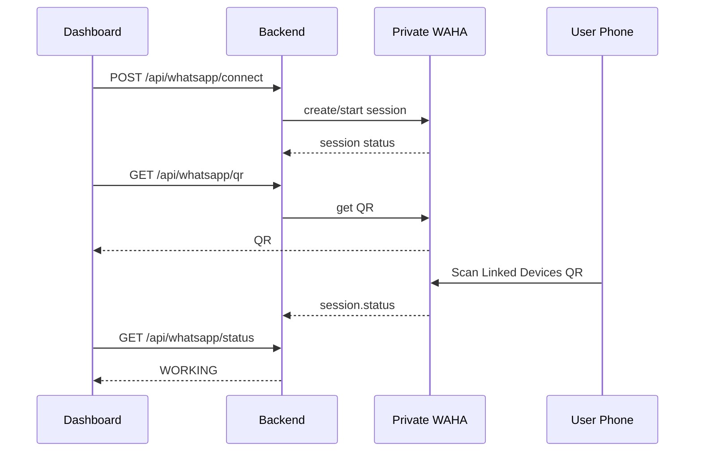
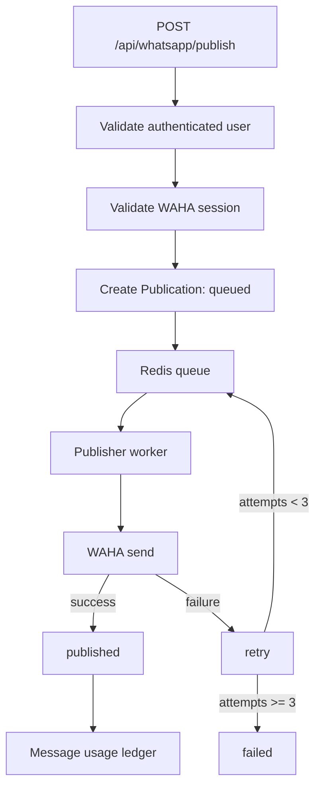
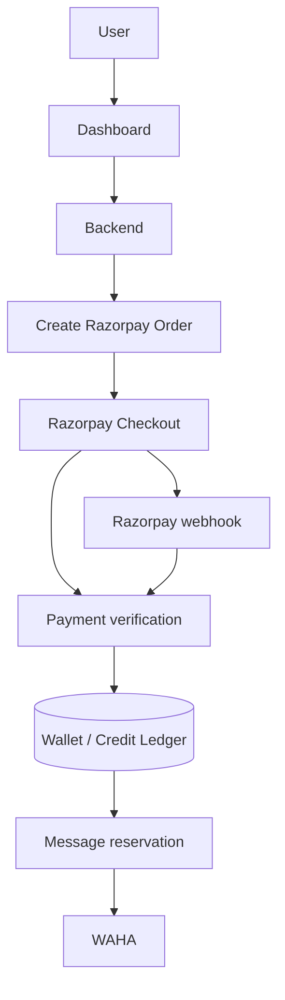
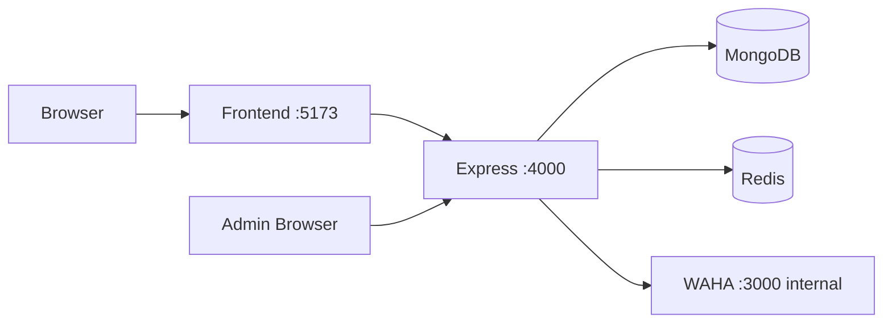
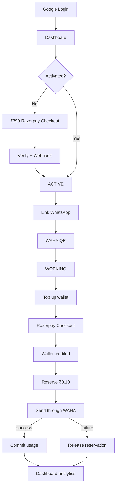

# SoloSync Backend Architecture

## System overview



## Authentication

Google authentication uses an OAuth authorization-code flow. The backend stores a short-lived OAuth state in Redis, exchanges the authorization code, verifies the Google ID token, then creates the SoloSync session using HTTP-only cookies. The backend never receives or stores the user's Google password.

## WhatsApp connection

Each user receives a deterministic WAHA session: `user_<mongodb-user-id>`.



WAHA must remain private; only the backend should call its API.

## Message lifecycle



Every publication stores recipient, type, content/media reference, status, attempts, provider message ID, error and timestamps.

## Dashboard analytics

Analytics are derived from publication history: total, successful, failed, queued/publishing, success rate, failure rate, and last-24-hour volume.

## Data model

### User
- email
- passwordHash (optional)
- googleId (optional)
- name
- avatarUrl
- authProvider

### WhatsappConnection
- userId
- provider
- sessionName
- status
- phoneNumber
- pushName
- activationRecorded

### Publication
- userId
- connectionId
- chatId
- kind
- text
- mediaUrl
- status
- attempts
- providerMessageId
- error
- publishedAt
- createdAt / updatedAt

### BillingLedger
- userId
- publicationId
- kind
- units
- amountPaise
- status
- note

## Razorpay billing architecture

Razorpay should handle relatively large payment events, not a new payment transaction for every ₹0.10 message. Use Razorpay for the ₹399 activation and prepaid wallet top-ups; use an internal paise ledger for message consumption.



### Activation

First WhatsApp activation costs ₹399. The backend creates the Order, the frontend opens Checkout, and the backend verifies the returned signature. The webhook then reconciles the payment idempotently. Only a verified/captured activation should enable the WhatsApp connection.

### Message usage

Do not create a Razorpay transaction for every ₹0.10 message. User tops up prepaid credits, the backend credits the wallet after verified payment, and each successful message consumes ₹0.10 internally. Reserve before sending, commit on successful WAHA delivery, and release the reservation on failure.

Example: ₹100 top-up = 10,000 paise = 1,000 message credits at ₹0.10/message.

## Planned Razorpay data model

### Payment
- userId
- type: activation | wallet_topup
- amountPaise
- currency
- razorpayOrderId
- razorpayPaymentId
- razorpaySignature
- status
- webhookEventsProcessed
- createdAt / updatedAt

### Wallet
- userId
- balancePaise
- reservedPaise
- updatedAt

### WalletTransaction
- userId
- type: topup | message_reservation | message_usage | reservation_release | refund | adjustment
- amountPaise
- balanceBeforePaise
- balanceAfterPaise
- referenceType
- referenceId
- createdAt

Payment and webhook processing must be idempotent.

## Razorpay security boundaries

- Frontend receives only `key_id`, order ID and safe payment metadata.
- Backend owns `key_id` and `key_secret`.
- Backend verifies Checkout signatures.
- Backend verifies webhook HMAC using the raw request body.
- Backend reconciles payment status before crediting the wallet.
- Never credit a wallet from a frontend-only success response.
- Use unique constraints/idempotency keys for payment and webhook processing.
- Store money as integer paise, never floating point.

Razorpay explicitly recommends server-side signature validation and webhook HMAC validation.

## Internal operations dashboard

The backend exposes an ActiveAdmin-style operations console at `/admin`. It provides overview metrics plus searchable-style resource tables for users, WhatsApp connections, publications, Razorpay payments, wallets and billing ledger records. The current implementation uses the existing Express backend rather than introducing a second Rails service, so the local stack stays small.

## Local development architecture



Run `docker compose -f docker-compose.local.yml up --build` from the backend repository after cloning the frontend beside it. Local billing is disabled by default, so WhatsApp and message flows can be tested without Razorpay.

## Production flow




## WhatsApp recipient resolution

Before sending to a direct phone number, the publisher resolves the number through WAHA `GET /api/contacts/check-exists`. WAHA can return either a regular `@c.us` chat ID or a migrated `@lid` chat ID; SoloSync persists the resolved ID on the publication before calling `sendText`, `sendImage`, or `sendVideo`. This avoids assuming that every WhatsApp user can still be addressed only by `@c.us`. The WAHA image is pinned rather than floating on `latest`.


## Developer platform architecture

The developer workspace sits on the existing authenticated dashboard and exposes a separate versioned public API.

```text
Developer
   |
   +--> Dashboard session (HTTP-only cookie)
   |      +--> Overview / Messages / Wallet / Account
   |      +--> API Keys
   |      +--> API Docs
   |      +--> API Playground
   |
   +--> Public API (/v1)
          |
          +--> Authorization: Bearer ss_live_...
          +--> Scoped API key lookup (SHA-256 hash)
          +--> Account / Usage
          +--> Connection / QR
          +--> Messages
          +--> Existing Redis -> WAHA publication worker
```

API key plaintext is returned only when a key is created or rotated. The database stores only the key hash plus display metadata such as prefix, last four characters, scopes, creation time and last-use time.

The developer API intentionally uses the same message publication pipeline as the dashboard so queueing, wallet reservation, WAHA recipient resolution, delivery reconciliation and webhook-driven delivery status remain consistent across both interfaces.
